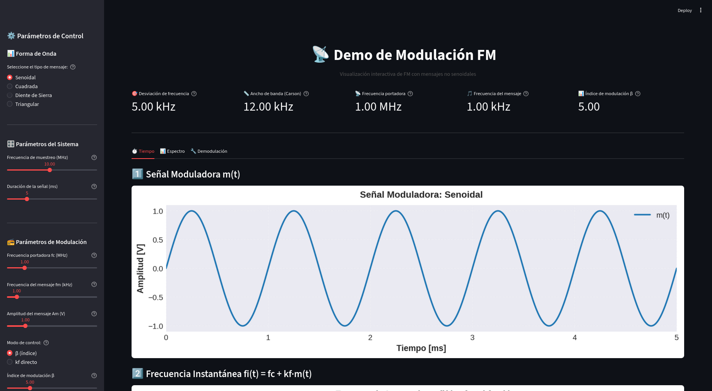

# 📡 demo-fm

**Interactive FM modulation demo with Streamlit.** 

Visualize non-sinusoidal waveforms, analyze spectra, and compare FM vs AM noise robustness in real-time.



---

## 🚀 Quick Start

### Option 1: Using virtual environment (Recommended)

```bash
./scripts/run_streamlit.sh
```

### Option 2: Auto-install and run

**Linux:**
```bash
./scripts/run_app.sh
```

**Windows:**
```bash
scripts\run_app.bat
```

### Option 3: Manual

```bash
pip install -r requirements.txt
streamlit run src/fm_demo_streamlit.py
```

---

## 📁 Project Structure

```
demo-fm/
├── docs/                   # Documentation
│   ├── README.md           # Detailed docs
│   ├── info.md             # Educational guide
│   └── INSTRUCCIONES.txt   # Spanish instructions
├── scripts/                # Run scripts
│   ├── run_app.sh
│   ├── run_app.bat
│   └── run_streamlit.sh
├── src/                     # Source code
│   └── fm_demo_streamlit.py
└── requirements.txt
```

---

## 📚 Documentation

- **[docs/info.md](docs/info.md)** - Small guide on FM concepts (Spanish)
- **[docs/INSTRUCCIONES.txt](docs/INSTRUCCIONES.txt)** - Setup instructions (Spanish)

---

## 🛠️ Tech Stack

- Python 3.8+
- Streamlit
- NumPy
- Matplotlib
